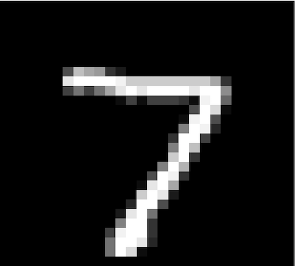
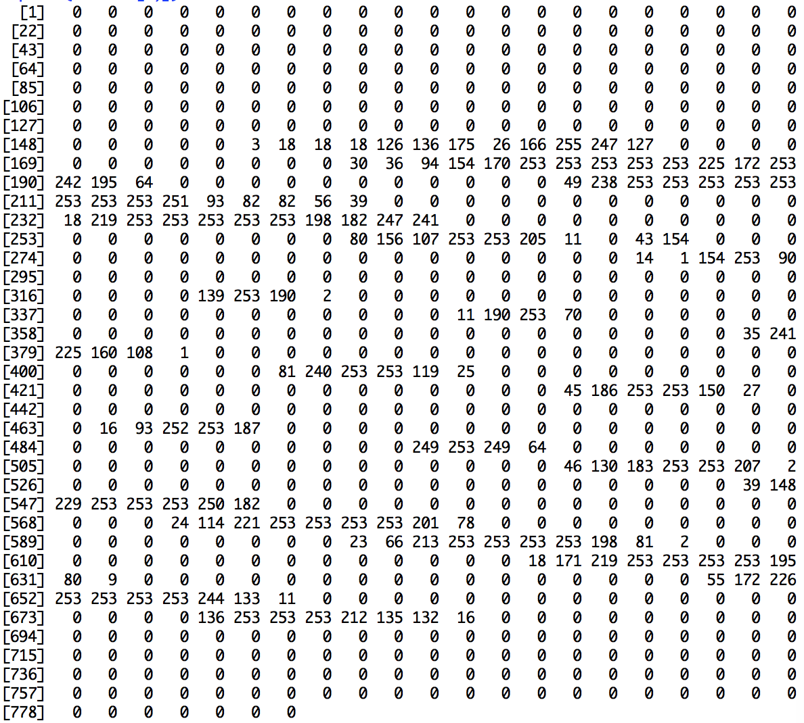
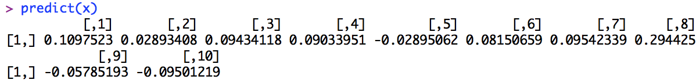
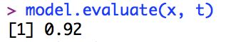

# 손으로 쓴 숫자 이미지를 판별하는 딥러닝을 R로만 구현하자!

## 프로젝트의 목표

이 프로젝트는 딥러닝 분야에서 유명한 [MNIST 데이터베이스](http://yann.lecun.com/exdb/mnist/)를 이용하여 손글씨로 쓴 숫자 이미지를 어떤 숫자인지 추론할 수 있는 Deep Learning(이하 딥러닝)을 R로만 구현하는 것을 목표로 진행되고 있습니다. 기본적으로 한빛미디어에서 출판한 [『밑바닥부터 시작하는 딥러닝』](http://www.hanbit.co.kr/store/books/look.php?p_code=B8475831198)과 이 책의 최근 Python(이하 파이썬) 코드인 [『ゼロから作る Deep Learning』(O'Reilly Japan, 2016)](https://github.com/oreilly-japan/deep-learning-from-scratch)를 참고하여 프로젝트를 진행하고 있습니다. 기본적으로 앞의 파이썬 코드를 따라가면서 ML을 구현하고 있지만, R에 없는 파이썬의 프로그래밍의 일부 기능은 R에 맞춰서 변경하였습니다.

전체 코드는 앞에도 언급했지만 [R](https://www.r-project.org)로 구현했습니다. 딥러닝을 구현하려면 행렬을 계산 할 프로그래밍이 필요한데, 이런 개념을 가장 쉽게 구현할 수 있는 언어가 R입니다. R이라는 언어를 모르시는 분들을 위해서 기초 가이드를 만들었습니다. 아래 R 기초 가이드를 참고하세요. [R 설치하기](https://choosunsick.github.io/post/r_install/)부터 차례대로 따라와 주시면 됩니다 :) 한 번씩 읽으시면 이 프로젝트를 이해하는데 많은 도움이 됩니다. 만약 R이 처음이 아니라면 아래 링크를 쭉 보시면서 따라오시면 기본적인 지식을 습득하실 수 있습니다.

1. [R 설치하기](https://choosunsick.github.io/post/r_install/)
2. [자료형 살펴보기](https://choosunsick.github.io/post/r_structure/)
3. [대표 문법 살펴보기](https://choosunsick.github.io/post/r_programming_grammar/)

[LOPES](http://www.lopes.co.kr)팀에서 이 프로젝트를 하게 된 이유는 딥러닝을 기초부터 공부하는 도중, 딥러닝을 R로 만들면 R 프로그래밍도 늘릴 수 있고, 딥러닝도 잘 이해할 수 있을 것 같아서 출발하게 되었습니다. 교육 목적으로 시작한 프로젝트이기 때문ㅇ R로 딥러닝를 구현하는 강좌도 프로젝트를 진행하면서 쓰고 있습니다. 아래 강좌를 참고하세요.

## 프로젝트 맛보기!

어떤 내용을 학습하게 될지 궁금하신 분들을 위해 프로젝트 맛보기를 준비했습니다. 프로젝트 전체 코드를 다운 받은 후, 아래 코드를 따라 입력해 보시는 걸 추천드립니다. 신기하거든요!:) 프로젝트 전체 코드를 다운 받으시려면, 이 프로젝트의 [메인 페이지](https://github.com/LOPES-HUFS/DeepLearningFromForR) 오른쪽 상단에 'Clone or download' 버튼을 클릭 후 'Download ZIP' 버튼을 눌러 다운 받으시거나 [git](https://git-scm.com/downloads)을 설치하셨으면 아래의 명령어를 커맨드 창에 입력하시면 됩니다.

```
$ git clone https://github.com/LOPES-HUFS/DeepLearningFromForR.git
```

코드를 다운 받으셨다면, R 에디터에서 디렉토리 설정을 진행해야 합니다. R를 연 후에 다음과 같이 디렉토리 경로를 입력해주세요. <PATH> 대신에 DeepLearningFromForR 폴더가 위치한 경로를 넣으면 됩니다.

```
$ setwd('<PATH>/DeepLearningFromForR')
```

다음으로 이 프로젝트에서 사용할 MNIST 데이터를 R 패키지 기능을 사용해서 아래 코드를 입력하여 설치합니다. 설치에 대한 자세한 내용은 [Mnist 손글씨 데이터 읽어오는 패키지 소개](https://choosunsick.github.io/post/mnist/)를 참조하시면 좋습니다.

```
$ install.packages("dslabs")
$ library(dslabs)
```

여기까지 진행하시면 기초 설정은 다 끝났습니다. 아래의 코드를 직접 입력해 보며 결과를 확인할 수 있을 것입니다. 이해는 잠시 뒤로한 채 가볍게 읽어 주세요.

### 데이터 학습하기 

이제 모델에 손글씨 데이터를 학습시켜 봅시다. 역전파 딥러닝 모델을 학습 시키는 자세한 내용에 대해서는 [링크](https://choosunsick.github.io/post/neural_network_backward_4/)를 참조해주시기 바랍니다.  

```R
source("./functions.R")
source("./utils.R")
source("./gradient.R")

TwoLayerNet <- function(input_size, hidden_size, output_size, weight_init_std  =  0.01) {
  W1 <- weight_init_std*matrix(rnorm(n  =  input_size*hidden_size), nrow  =  input_size, ncol  =  hidden_size)
  b1 <- matrix(rep(0,hidden_size),nrow = 1,ncol = hidden_size)
  W2 <- weight_init_std*matrix(rnorm(n  =  hidden_size*output_size), nrow  =  hidden_size, ncol  =  output_size)
  b2 <- matrix(rep(0,output_size),nrow = 1,ncol = output_size)
  params <<- list(W1 = W1, b1 = b1, W2 = W2, b2 = b2)
  return(list(input_size, hidden_size, output_size,weight_init_std))
}

TwoLayerNet(input_size = 784, hidden_size = 50, output_size = 10)

```

우선 필요한 함수를 불러오고 모델의 초기값을 생성해줍니다. 다음에는 학습할 데이터를 가져옵니다. 

```R
mnist_data <- get_data()

x_train_normalize <- mnist_data$x_train
x_test_normalize <- mnist_data$x_test

t_train_onehotlabel <- making_one_hot_label(mnist_data$t_train,60000,10)
t_test_onehotlabel <- making_one_hot_label(mnist_data$t_test,10000,10)

```
학습할 데이터를 처리해주고 나면 학습을 위한 파라미터를 설정해줍니다. 

```R
iters_num <- 10000
train_size <- dim(x_train_normalize)[1]
batch_size <- 100
learning_rate <- 0.1

train_loss_list <- data.frame(lossvalue  =  rep(0,iters_num))
train_acc_list <- data.frame(train_acc  =  0)
test_acc_list <- data.frame(test_acc  =  0)

iter_per_epoch <- max(train_size / batch_size)
```

다음은 학습을 실제로 진행하는 코드입니다.

```R
for(i in 1:iters_num){
  batch_mask <- sample(train_size ,batch_size)
  x_batch <- x_train_normalize[batch_mask,]
  t_batch <- t_train_onehotlabel[batch_mask,]
  
  grad <- gradient(x_batch, t_batch)
  
  params$W1 <- params$W1 - (grad$W1 * learning_rate)
  params$W2 <- params$W2 - (grad$W2 * learning_rate)
  params$b1 <- params$b1 - (grad$b1 * learning_rate)
  params$b2 <- params$b2 - (grad$b2 * learning_rate)
  
  loss_value <- backward_loss(x_batch, t_batch)$loss
  train_loss_list <- rbind(train_loss_list,loss_value)
  
  if(i %% iter_per_epoch == 0){
    train_acc <- model.evaluate.backward(x_train_normalize, t_train_onehotlabel)
    test_acc <- model.evaluate.backward(x_test_normalize, t_test_onehotlabel)
    train_acc_list <- rbind(train_acc_list,train_acc)
    test_acc_list <- rbind(test_acc_list,test_acc)
    print(c(train_acc, test_acc))
  }
}
```

위 코드를 실행시키고 3분 정도 지나면 아래와 같은 출력화면이 나올 것입니다. 

```R
[1] 0.9012333 0.9055000
[1] 0.9225333 0.9236000
[1] 0.9380167 0.9360000
[1] 0.9459667 0.9428000
[1] 0.9528667 0.9496000
[1] 0.9568 0.9525
[1] 0.9602833 0.9560000
[1] 0.9642333 0.9592000
[1] 0.9674333 0.9600000
[1] 0.9692167 0.9633000
[1] 0.97025 0.96430
[1] 0.9729833 0.9653000
[1] 0.9740167 0.9653000
[1] 0.9757333 0.9660000
[1] 0.9769 0.9677
[1] 0.9782833 0.9691000
```

약 96~97%의 성능의 모델을 얻을 수 있습니다. 이제 이 모델을 가지고 숫자를 예측해봅시다. 위 학습과정의 자세한 설명은 [링크](https://choosunsick.github.io/post/contents_list/)의 오차역전파법 글을 확인해주세요. 

### 숫자 맞추기 

위 모델이 MNIST의 숫자 이미지를 사용하여 어떻게 숫자를 예측하는지 살펴 보겠습니다. 먼저 MNIST 숫자 이미지를 확인합니다.

```R
draw_image(mnist_data$x_train[2,])
```

위 숫자 이미지는 0입니다. R은 1부터 표시하기 때문에 정답 레이블은 1이됩니다. 과연 이 모델은 숫자 0을 맞출 수 있을까요? 

```R
predict.backward(x_train_normalize[2,])

          [,1]         [,2]         [,3]         [,4]         [,5]         [,6]         [,7]         [,8]         [,9]
[1,] 0.9995271 2.476334e-10 0.0004688242 7.157812e-07 4.546836e-12 1.590027e-07 4.166702e-07 2.015688e-06 3.718068e-08
            [,10]
[1,] 7.639079e-07
```

위 값이 숫자를 예측한 값입니다. 순서대로 0부터 9까지 해당 숫자가 정답일 확률을 의미합니다. 보시다싶이 모델의 예측은 정답 레이블 1에 대해서 약99% 확률을 보여줍니다.  다시 말해,0.9995271은 이미지 숫자가 0일 확률이 99.9%임을 의미합니다. 그외 숫자들에 대해서는 너무도 작은 확률이기에 모델은 정답을 맞춘것입니다. 

### 전체 테스트 셋 추론하기

이제 위 모델이 전체 테스트셋 이미지 1만장을 얼마나 잘 맞추는지 확인해 보겠습니다. 

```R
model.evaluate.backward(x_test_normalize,t_test_onehotlabel)
[1] 0.9698
```

여기서 결과값은 0.9698로 인공지능이 숫자를 맞출 확률이 약 97%임을 의미합니다. 학습을 더 많이 반복하거나 합성곱과 같은 방법을 사용한다면 정확독 무려 99%까지도 가능합니다! 차후 프로젝트를 진행해 나가면서 정확도를 99%까지 올리는 것도 같이 확인해 보겠습니다.

### 숫자 맞추기
앞서 설명드린 MNIST의 숫자 이미지를 사용하여 어떻게 숫자를 예측하는지 살펴 보겠습니다. 먼저 MNIST 숫자 이미지를 확인합니다.

```R
library(dslabs)
mnist <- read_mnist()
x_train <- mnist$train$images

draw_image <- function(x){
    return(image(1:28, 1:28, matrix(x, nrow=28)[ , 28:1], col = gray(seq(0, 1, 0.05)), xlab="", ylab=""))
    }

draw_image(x_train[2,])
```



위 숫자 이미지는 7입니다. MNIST에는 이런 이미지가 7만개 있습니다. 우리는 이 이미지를 보고 7이라는 것을 바로 알지만, 인공지능은 학습이 필요합니다. 인공지능을 학습할 때에는 이미지를 행렬로 변환하여 학습시킵니다. 변환된 행렬은 다음과 같습니다.

```R
print(x_train[1,])
```


인공지능은 이 행렬을 보고 어떤 숫자인지 예측합니다. 그리고 나서 예측한 값이 맞았는지, 틀렸는지 확인합니다. 인공지능은 이 과정을 반복하면서 자신의 인지 능력을 개선해 나가는데, 우리는 이를 학습한다고 표현합니다.
이미지에 대한 예측값은 아래와 같습니다.

```R
library(dslabs)

mnist <- read_mnist()
x_train <- mnist$train$images
x_train_normalize <- x_train/255
x <- x_train_normalize[1,]

W <- 0.01*matrix(rnorm(n = 784*10), nrow = 784, ncol = 10)

predict <- function(x){
        return(x %*% W)
    }

predict(x)
```


위 값이 숫자를 예측한 값입니다. 순서대로 0부터 9까지 해당 숫자가 정답일 확률을 의미합니다. 다시 말해,
0.1097523은 이미지 숫자가 0일 확률이 10.9%임을 의미하며 0.02893408는 숫자 1일 확률을 의미힙니다. 이 중 가장 높은 확률을 인공지능이 예측한 값으로 봅니다. 여기서 가장 큰 값은 0.294425이므로 7이라고 예측했음을 알 수 있습니다.

### 전체 테스트 셋 추론하기
실제 프로젝트에서는 이미지 7만개를 사용합니다. 학습을 얼마나 잘했냐에 따라 인공지능의 예측률이 달라지는데, 아래는 저희가 학습시킨 인공지능의 예측률입니다. 

```R
source('./sample/chapter5_sample.R')

x_test <- mnist$test$images
t_test <- mnist$test$labels

x_test_normalize <- x_test/255
t_test_onehotlabel <- making_one_hot_label(t_test,10000,10)

batch_mask <- sample(10000,100)

x <- x_test_normalize[batch_mask,]
t <- t_test_onehotlabel[batch_mask,]

model.evaluate(x, t)
```



여기서 결과값은 0.92로 인공지능이 숫자를 맞출 확률이 92%임을 의미합니다. 학습을 더 많이 반복하거나 학습법을 개선한다면 무려 99%까지도 가능합니다! 프로젝트를 통해 정확도를 99%까지 올리는 것도 같이 확인해 보겠습니다.

## R 초심자를 위한 R 설치방법과 기초 사용방법

R이 처음이신 분들을 위한 가이드를 작성해 보았습니다.
R 설치하기부터 차례대로 따라와 주시면 됩니다:)

1. [R 설치하기](https://choosunsick.github.io/post/r_install/)
2. [자료형 살펴보기](https://choosunsick.github.io/post/r_structure/)
3. [대표 문법 살펴보기](https://choosunsick.github.io/post/r_programming_grammar/)


프로젝트를 함께 따라오다보면 어느새 작은 인공지능을 만들고 그 원리를 이해할 수 있을 것입니다. 
딥러닝을 시작하기 전에는 수학부터 해야 돼, 코딩부터 해야돼 라면서 딥러닝 공부를 미루지 마세요. 딥러닝 원리를 이해하면서 수학도 코딩도 같이 이해해 나가면 됩니다.

같이 공부해요!:)

* 오타 발견 및 문의 사항은 언제나 환영하며 Issues에 등록 부탁드립니다.
  * Issues : https://github.com/LOPES-HUFS/DeepLearningFromForR/issues
* DeepLearningFromForR 프로젝트는 [한국외국어대학교 LOPES 스터디 그룹](http://lopes.hufs.ac.kr)에서 진행합니다.
